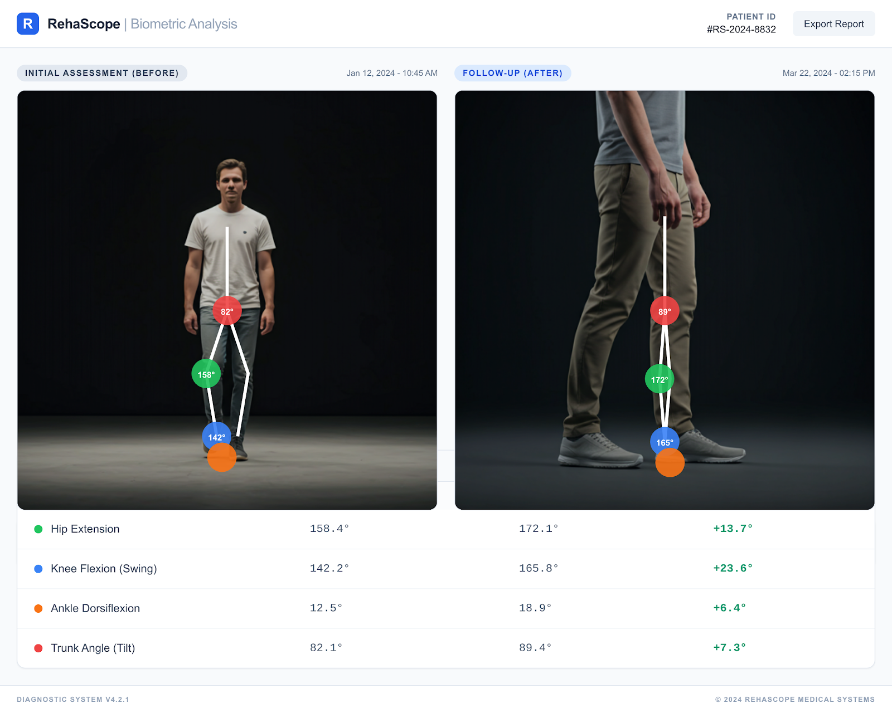
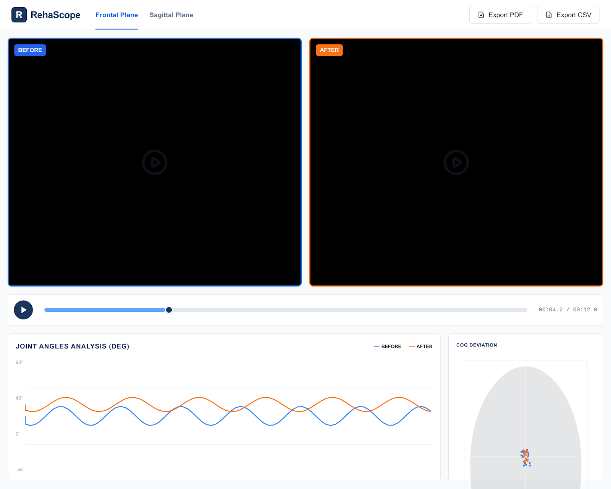
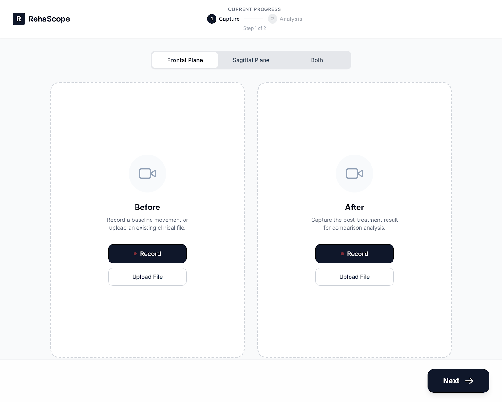
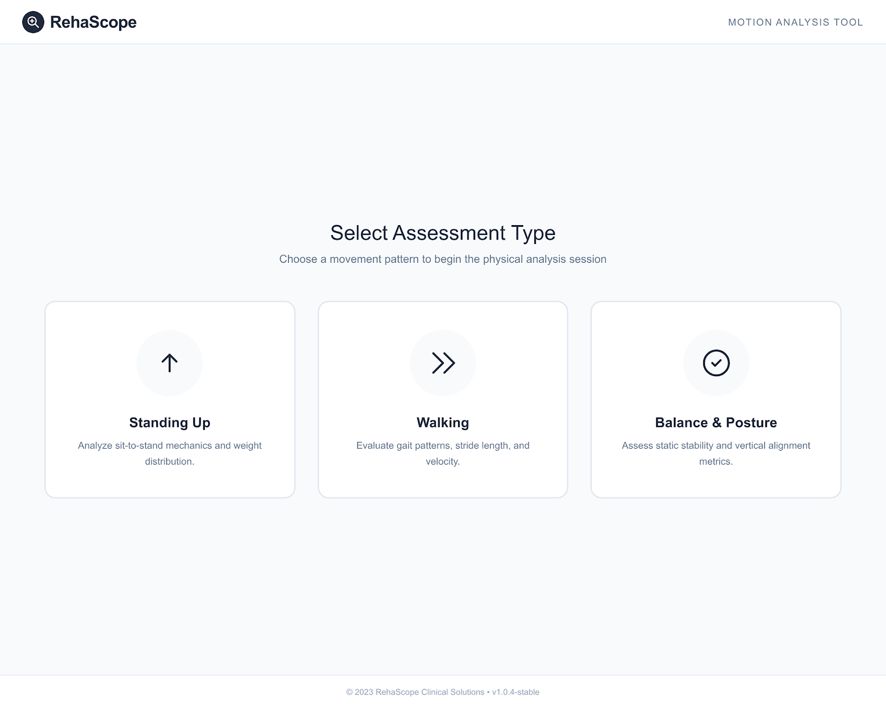

# RehaScope — 理学療法士向け動作解析 PWA

**理学療法の治療前後を動画で比較し、関節角度・重心偏位を自動計測するブラウザアプリ。**  
専用機材不要。iPadとこのアプリだけで、感覚評価を数値に変える。

[](https://reha-scope.vercel.app)


| | |
|---|---|
| **開発体制** | 個人開発（設計・実装・ユーザーインタビュー・デプロイ すべて一人） |
| **開発フロー** | プロトタイプ開発 → 現場デモ・フィードバック取得 → セキュリティ要件発覚 → アーキテクチャ再設計 → 院内導入 |

---

## なぜ作ったか

理学療法士（PT）は学生のころから「自分の目で見ているものが、本当にそうなのか」という問いを持ち続ける。  
患者の動作を評価するとき、何十年のベテランでも最終的には**目視と感覚**に頼るしかない。改善を「数値」として示す手段がなかった。

- 三次元動作解析装置（VICON等）は1台数百万円、操作に専門知識が必要
- 院内に導入できているのはごく一部の大病院のみ
- 日常臨床で使えるツールは「分度器で角度を測る」レベルで止まっていた

この課題は特定の施設の問題ではなく、**PT全員が共通して抱える構造的な問題**だと気づいた。  
だから「iPadだけで、誰でも、どこでも使える動作解析ツール」を作ることにした。

---

## スクリーンショット

### ポーズオーバーレイ：骨格検出 + 関節角度の前後比較


### 解析画面：同期再生 + 関節角度グラフ + 重心偏位


### 動画入力：治療前後の撮影・アップロード


### ホーム：評価動作の選択


---

## 現場からのフィードバック

実際に病院スタッフ（PT・病棟スタッフ）に直接デモを行った。

> 「こんなの、誰が作ったの？」  
> 「こういうの、ずっと欲しかった」  
> 「これ、無料で作れるの？」

医療現場のスタッフは AI の存在を知っていても、**何ができるかまでは知らない人が多い**。  
動いているものを見せることで初めて「これが自分たちの仕事に使えるもの」と理解してもらえた。

また、同様の機能を持つ企業製ツール（動作解析・歩行分析）は  
**月額数万〜数十万円、導入費用は数百万円**になることも珍しくない。  
病院の約7割が赤字とされる医療財政の中で、新規ツールへの投資はほぼ不可能に近い。  
「無料で動く」ことがこれほど刺さる現場だということを、デモを通じて実感した。

---

## 主な機能

| 機能 | 詳細 |
|------|------|
| **骨格検出** | MediaPipe Pose（WASM）で全33関節を15fpsリアルタイム検出、ブラウザ完結 |
| **関節角度計測** | 股関節・膝関節・足関節・体幹傾斜を前後比較（Δ表示付き） |
| **重心偏位分析** | 左右・前後の重心軌跡を足底面上にプロット、安定性指標を算出 |
| **分割同期再生** | Before（青）/ After（橙）を同一タイムラインで再生 |
| **フレーム指定スナップショット** | 任意フレームでスケルトン + 数値を静止画として確認 |
| **PDF / CSVエクスポート** | 臨床記録として出力、カルテ添付や引き継ぎに対応 |
| **PWA・オフライン動作** | Service Worker + IndexedDB により院内Wi-Fiなしでも稼働 |
| **患者データ非送信** | すべての処理をクライアント完結、動画・個人情報はサーバーへ送らない |

---

## 技術スタック

| 技術 | 用途・選定理由 |
|------|--------------|
| **Next.js 15 / React 19 / TypeScript 5** | フロントエンド。静的エクスポートでバックエンドなし運用が可能、将来的なサーバー追加にも対応できる拡張性を確保 |
| **Tailwind CSS 4** | スタイリング |
| **MediaPipe Pose（Web WASM）** | ブラウザ内で骨格推定を完結できる唯一の選択肢。外部サーバーへの通信が発生しないため病院のセキュリティ要件に合致する |
| **Recharts** | 関節角度の時系列グラフ描画 |
| **jsPDF + html2canvas** | PDF レポート生成 |
| **next-pwa（Workbox）+ IndexedDB** | PWA・オフライン対応。iOS Safari の Blob URL 解放問題への対処も兼ねる |
| **Vercel** | CI/CD・CDN・SSL を個人開発で即座に揃えられる現実的な選択 |
| **Jest 30 + React Testing Library** | テスト |

---

## 院内展開でぶつかった課題

### 課題1：病院 IT 部門のセキュリティ審査を通過できなかった（最大の壁）

最初のバージョンはオンライン前提で設計していた。  
担当者に見せると「すごい」と反応は良かったが、すぐに問題が出た。

> 「患者の動画がインターネットを経由するのは困る。  
>  サーバーに動画が残るリスク、通信中の傍受リスク、どちらも許可できない。」

これは現場 PT の問題ではなく、**病院組織としてのコンプライアンス要件**だった。  
どれだけ便利でも、セキュリティポリシーに引っかかれば導入は不可能。

**判断**: アーキテクチャを全面的に再設計。動画・骨格データを一切サーバーへ送らない構成にした。

- MediaPipe（AI骨格検出）を WASM 版に切り替え → ブラウザ内で推論、外部通信ゼロ
- バックエンドサーバーを撤廃 → Vercel の静的ホスティングのみ
- 動画は IndexedDB（ブラウザ内 DB）に保存、セッション終了時に自動削除

この変更により「**オフラインで動くなら、限定的な利用なら許可できる**」という承認を得た。  
現在、段階的な院内展開を進めている。

---

### 課題2：オフライン化に伴う技術的問題

アーキテクチャ変更後、オフライン対応の実装で連鎖的に問題が発生した。

**AI モデルのキャッシュ戦略が破綻**  
MediaPipe のモデルファイルは 24MB。Service Worker のプリキャッシュに含めると  
インストールが毎回タイムアウトし、**PWA としてデバイスにインストールできない**バグが発生した。  
モデルをプリキャッシュから除外し、ランタイムの `CacheFirst` 戦略に変更することで解決。  
フォントファイル 131 本（7.6MB）も同様にオンデマンド取得へ変更した。

**iOS Safari でページ遷移後に動画が消える**  
iOS は Blob URL をページ遷移後に解放するため、分析画面への移動と同時に動画が読めなくなった。  
`videoDB.ts`（IndexedDB ラッパー）で Blob を永続化し、`SESSION_ALIVE_KEY` でアプリ終了を検知、  
次回起動時に DB をクリアすることでプライバシーも担保した。

設計段階でオフライン要件を想定していなかったことが根本原因であり、  
**制約を最初に洗い出す重要性**を痛感した。

---

### 課題3：歩行解析での「折り返し問題」

歩行を往復撮影すると、折り返し瞬間に骨格が背中向きになり**異常な座標を大量に拾う**。  
統計値からは除外できても、時系列グラフ上にノイズが残り、臨床資料として使えない。

試行錯誤の末、**「片道撮影のみ」という制約をUXに組み込む**ことで解決した。  
撮影ガイドを入力画面に明示し、データ品質を担保する設計にした。  
技術で全部解決しようとするのではなく、運用フローを変えることで問題を消す判断だった。

---

## 次にやりたいこと（企業として取り組むべき課題）

RehaScope を作り、現場に持ち込んで初めて見えてきた課題がある。

### 1. 間接業務の AI 自動化（書類・カルテ）

PT は 1 日に 10 人前後の患者を担当する。新患のカルテ記載は 1 件あたり 10〜20 分、  
通常でも 2〜6 分かかり、リハビリ計画書の作成も 1 件 10 分近い。  
診療報酬が発生しないこれらの間接業務が、1 日の業務時間のうち相当な割合を占めている。

口頭での申し送りや記録をそのまま文章化し、「確認して承認するだけ」にできれば、  
PT が患者に向き合う時間を大幅に増やせる。しかし LLM は海外サーバー上で動作することが多く、  
医療の最重要個人情報を外部に送ることは現状難しい。  
**ローカル LLM またはオンプレミス構成**での実装が必要であり、個人開発では実現できない。

### 2. リアルタイム臨床意思決定支援

患者からその場で質問を受けたとき、知識や経験が不足していると答えられずうやむやになる。  
これは患者との信頼関係に直結する問題であり、経験年数によって医療の質に差が生まれる構造的な原因でもある。  
文献検索は結局、自分の時間外でやらざるを得ない。

将来的には、インカムやスマートグラスを通じて会話の文脈から必要な情報を検出し、  
エビデンスや治療選択肢をリアルタイムで提示できる仕組みが実現するかもしれない。  
そこまでいかなくても、**臨床の場で使えるレベルの意思決定支援**を作ることが次の目標だ。

これらはどちらも、プライバシー・ガバナンス・組織の信頼性が伴わなければ現場に届かない。  
個人開発で学んだその限界が、企業として取り組む理由そのものだと思っている。

---

## 個人開発の限界と、このプロジェクトが示すもの

技術的な課題をひとつひとつ解決していく中で、もっと根本的な壁にぶつかった。

病院の総務課部長に直接デモを見せたとき、こう言われた。

> 「良いとは思う。でも個人が作ったものは、うちでは認められない。  
>  企業が開発したもの、App Store に公開されているもの、  
>  組織として責任を持てるものでないと、導入の判断はできない。」

言われた瞬間、真っ先に思ったのは「最初からオフラインで設計しておくべきだった」という反省だった。  
そしてこれは感情的な拒絶ではなく、**医療機関が当然持つべきガバナンスの話**だと理解した。

患者の個人情報を扱う以上、ツールの導入には「何かあったとき誰が責任を取るか」が問われる。  
個人開発者にはその責任の受け皿がない。IT 部門が懸念したセキュリティも、  
総務課部長が言った「企業のもの」という条件も、すべて**組織としての説明責任**に帰結していた。

医療 DX を現場に届けるには、技術力だけでなく、  
**ガバナンス・信頼性・責任体制を持った組織**が不可欠だということを、この経験で実感した。

---

一方で、医療 DX の需要は確実に高まっている。  
2026年度の診療報酬改定では、AI・ICT ツールの導入により看護職員や診療補助職員の人員配置基準に柔軟性が認められるようになった。  
人手不足でも DX に取り組めば高い点数を維持できる仕組みであり、病院側がツール導入を検討する制度的な後押しになっている。  
現場のニーズと制度的な追い風は、どちらも揃っている。

個人開発でここまで来たからこそ、**次は組織の中でやるべきだ**という確信がある。

PT としての臨床ドメイン知識と、このアプリを一人で設計・実装・展開した経験を持つ人間が  
企業の開発チームにいることで、「現場でなぜ使われないか」「どこが本当の課題か」を  
コードと現場の両方の言語で語れる。それが自分の役割だと考えている。

---

## ローカル起動

```bash
git clone https://github.com/Sho323/reha-scope.git
cd reha-scope
npm install
npm run dev
```

デモパスワード: `demo2026`

> 本プロジェクトは Claude Code（Anthropic）をコーディング補助として活用しながら、設計・実装・デプロイまで個人で行いました。

---

## ライセンス

MIT
